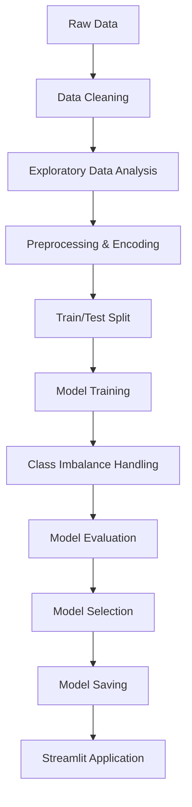

# Diabetes Risk Prediction Using Machine Learning

A machine learning-based risk prediction demonstration built on patient health indicators, deployed as an interactive Streamlit application.

---

## Table of Contents

1. [Project Overview](#project-overview)
2. [Disclaimer](#disclaimer)
3. [Features](#features)
4. [Dataset](#dataset)
5. [Machine Learning Workflow](#machine-learning-workflow)
6. [Data Preprocessing](#data-preprocessing)
7. [Models](#models)
8. [Handling Class Imbalance](#handling-class-imbalance)
9. [Model Evaluation](#model-evaluation)
10. [Why XGBoost?](#why-xgboost)
11. [Streamlit Application](#streamlit-application)
12. [Project Structure](#project-structure)
13. [Installation](#installation)
14. [Running the Application](#running-the-application)
15. [Model Training](#model-training)
16. [Results](#results)
17. [Limitations](#limitations)
18. [Future Improvements](#future-improvements)
19. [Skills Demonstrated](#skills-demonstrated)
20. [Learning Outcomes](#learning-outcomes)
21. [Author](#author)
22. [License](#license)

---

## Project Overview

This project applies supervised machine learning to predict diabetes risk from patient health data. It covers the full ML workflow — data preprocessing, exploratory analysis, model training, model comparison, and evaluation — and ends with a trained XGBoost classifier deployed behind a Streamlit web interface.

The goal is to demonstrate an end-to-end, reproducible ML pipeline: from raw tabular data to a working, interactive prediction tool, with particular attention paid to correctly handling class imbalance and preprocessing consistency between training and inference.

The final Streamlit application allows a user to enter patient feature values (age, BMI, glucose level, etc.) and receive a model-generated diabetes risk prediction along with class probabilities.

## Disclaimer

> This project is for **educational and demonstration purposes only**. It is **not** a medical diagnostic system and should not be used to make healthcare decisions. Predictions are the output of a statistical model trained on a public dataset and carry no clinical validation.

## Features

- Data preprocessing pipeline with partial feature scaling
- Class imbalance handling via `scale_pos_weight`
- Model comparison across multiple classification algorithms
- Final model: XGBoost, selected based on recall performance
- Interactive Streamlit web app for real-time predictions
- Model confidence displayed as class probabilities
- Built-in sanity-check tool (predefined "healthy" vs. "at-risk" test cases) in the app sidebar
- Cached model/scaler loading for fast repeated inference

## Dataset

**Dataset:** Kaggle Diabetes Prediction Dataset

> `[TODO: Confirm exact dataset name/source]` — The original project brief for this repository referenced the *UCI Diabetes 130-US Hospitals (1999–2008)* dataset. However, the feature set implemented in `app.py` (`age, hypertension, heart_disease, bmi, HbA1c_level, blood_glucose_level, gender, smoking_history`) does not match that dataset's schema and instead matches the commonly used **Kaggle "Diabetes Prediction Dataset."** This README documents the dataset as evidenced by the code. Please confirm the correct source before publishing and update this section (and the dataset link below) accordingly.

The dataset contains patient-level records with a mix of demographic, clinical, and lifestyle features used to predict diabetes status:

| Feature | Type | Notes |
|---|---|---|
| `age` | Numeric | Scaled |
| `hypertension` | Binary (0/1) | Scaled |
| `heart_disease` | Binary (0/1) | Scaled |
| `bmi` | Numeric | Scaled |
| `HbA1c_level` | Numeric | Scaled |
| `blood_glucose_level` | Numeric | Scaled |
| `gender` | Categorical (one-hot: `Male`, `Other`; `Female` is baseline) | Not scaled |
| `smoking_history` | Categorical (label-encoded) | Not scaled |

**Prediction target:** Binary diabetes outcome (Diabetic / Non-Diabetic).

`[ADD YOUR DATASET SOURCE/LINK HERE]`

## Machine Learning Workflow



## Data Preprocessing

Based on the deployed inference pipeline (`app.py`), preprocessing follows this design:

- **Partial scaling:** A `StandardScaler` was fit **only** on six continuous/binary numeric features — `age, hypertension, heart_disease, bmi, HbA1c_level, blood_glucose_level`. This scaler is loaded at inference time and applied to those same six columns only.
- **Unscaled categorical encodings:** `gender` is one-hot encoded into `gender_Male` and `gender_Other` (with `Female` as the implicit baseline), and `smoking_history` is label-encoded using a fixed mapping (`No Info, current, ever, former, never, not current` → `0–5`). Both are passed to the model **unscaled**.
- **Strict feature ordering:** The model expects a fixed column order — `[age, hypertension, heart_disease, bmi, HbA1c_level, blood_glucose_level, gender_Male, gender_Other, smoking_history]` — which the app reconstructs explicitly before calling `.predict()`.

> **Note:** This partial-scaling setup (scaling six of nine features, leaving the rest untouched) was a deliberate design decision that had to be carefully replicated between training and the Streamlit frontend — mismatches here were a known source of prediction bugs during development. This is also why the scaler is saved and loaded as its own artifact (`scaler.pkl`) rather than re-fit inside the app.

`[TODO: Add missing-value handling, feature selection, and train/test split ratio details from the training notebook/script, if available]`

## Models

| Model | Purpose | Recall |
|---|---|---:|
| Logistic Regression | Baseline classification model | 59% |
| Random Forest | Ensemble classification model | 67% |
| XGBoost | Gradient boosting model | 69% (initial) |
| XGBoost + class weighting | Improved minority-class handling | 91% |

> These recall figures are from this project's own experiments and are not guaranteed to be reproducible outside this environment/dataset split. `[TODO: Confirm figures against training notebook/logs if publishing]`

## Handling Class Imbalance

The dataset exhibits class imbalance between diabetic and non-diabetic cases, which can make accuracy a misleading metric — a model can score high accuracy simply by favoring the majority class while missing most true-positive (at-risk) cases.

To address this, `scale_pos_weight` was calculated and applied to the XGBoost classifier:

```python
neg_count = y_train.value_counts()[0]
pos_count = y_train.value_counts()[1]
scale_pos = neg_count / pos_count

xg = xgb.XGBClassifier(
    max_depth=5,
    scale_pos_weight=scale_pos,
    random_state=42
)

xg.fit(x_train, y_train)
```

`scale_pos_weight` increases the penalty for misclassifying the minority (positive) class during training, pushing the model to pay closer attention to at-risk cases it might otherwise overlook. After applying this, XGBoost's recall improved from **69% to approximately 91%** in this project's experiments.

## Model Evaluation

Recall was prioritized as the primary metric for this project because, in a diabetes-risk context, a **false negative** (an at-risk person classified as low-risk) is a more consequential error than a false positive. That said, recall alone doesn't tell the full story, and should be considered alongside:

| Metric | Value |
|---|---|
| Accuracy | `[ADD YOUR ACCURACY HERE]` |
| Precision | `[ADD YOUR PRECISION HERE]` |
| Recall | 91% (XGBoost, after `scale_pos_weight`) |
| F1-score | `[ADD YOUR F1-SCORE HERE]` |
| Confusion Matrix | `[ADD CONFUSION MATRIX / SCREENSHOT HERE]` |
| ROC-AUC | `[ADD ROC-AUC IF AVAILABLE]` |

## Why XGBoost?

XGBoost was selected as the final model for this project because:

- It performs strongly on structured/tabular data relative to the other models tried.
- It can model nonlinear relationships between features via gradient-boosted decision trees.
- Its ensemble boosting approach combines many weak learners into a stronger overall model.
- It natively supports class-imbalance handling through `scale_pos_weight`.
- It produced the best recall in this project's experiments (91% after weighting).

This is a project-specific choice based on the evaluation results and objective (recall), not a claim that XGBoost is universally superior to every other algorithm.

## Streamlit Application

The deployed app (`app.py`) provides a simple UI for interacting with the trained model:

1. **Input collection** — the user fills out a form with patient details: age, BMI, HbA1c level, blood glucose level, gender, hypertension status, heart disease status, and smoking history.
2. **Model & scaler loading** — `xgb_model.pkl` and `scaler.pkl` are loaded once via `st.cache_resource` for fast repeated predictions.
3. **Preprocessing** — the six numeric fields are scaled with the saved `StandardScaler`; gender and smoking history are encoded and appended unscaled, in the exact column order the model expects.
4. **Prediction** — the model returns a class prediction and probability scores via `.predict()` / `.predict_proba()`.
5. **Result display** — the app shows a High Risk / Low Risk result with a confidence percentage, plus a probability breakdown for both classes. An expandable panel shows the exact (post-scaling) feature row sent to the model.
6. **Sanity check** — a sidebar tool runs two predefined test cases ("Healthy young", "Unhealthy senior") so predictions can be sanity-checked against expected direction before trusting the app.

`[TODO: Add a screenshot, e.g. , if one exists in the repository]`

## Project Structure

Based on the files provided:

```text
diabetes-prediction/
│
├── app.py              # Streamlit inference application
├── xgb_model.pkl        # Trained XGBoost classifier
├── scaler.pkl            # StandardScaler fit on 6 numeric features (referenced by app.py)
├── requirements.txt      # [TODO: add if not already present]
├── README.md
└── ...
```

> `[TODO: Add notebooks/, data/, or other directories once confirmed — only `app.py` and `xgb_model.pkl` were available for this README]`

## Installation

```bash
git clone <repository-url>
cd <repository-name>

python -m venv venv
venv\Scripts\activate

pip install -r requirements.txt
```

`[TODO: Add/confirm requirements.txt — known dependencies based on app.py: streamlit, pandas, numpy, joblib, xgboost, scikit-learn]`

## Running the Application

```bash
streamlit run app.py
```

Ensure `xgb_model.pkl` and `scaler.pkl` are present in the same directory as `app.py` — the app will show an error if either file is missing.

## Model Training

`[TODO: Add the training notebook/script name and reproduction steps — no training notebook was included in the files reviewed for this README]`

## Results

| Model | Recall |
|---|---:|
| Logistic Regression | 59% |
| Random Forest | 67% |
| XGBoost (before class weighting) | 69% |
| XGBoost (after `scale_pos_weight`) | **91%** |

These are experimental results from this project's own training run. `[TODO: Add accuracy, precision, F1-score, and confusion matrix here if available]`

## Limitations

- The exact source dataset needs confirmation — see the note in the [Dataset](#dataset) section.
- The model is **not clinically validated** and should not be used for real healthcare decisions.
- Model performance is dependent on the quality and representativeness of the training data.
- Class imbalance can still affect edge-case predictions even after weighting.
- **Probability instability:** during testing, small changes in input (e.g. glucose 200 → 201) were observed to produce noticeably different prediction probabilities in at least one case. Tree-based models like XGBoost make predictions based on learned decision regions, which can produce non-smooth probability behavior near region boundaries — unlike smoother parametric models. This is a known characteristic worth further investigation, not necessarily a bug.
- No external/independent clinical validation has been performed.

## Future Improvements

**Planned / not yet implemented:**
- Probability calibration (e.g. Platt scaling, isotonic regression) to address the sharp-probability-change issue noted above
- More systematic hyperparameter tuning (grid/random search, Optuna, etc.)
- k-fold cross-validation for more robust performance estimates
- SHAP or other model explainability tooling
- Experiment tracking (e.g. MLflow)
- API deployment (e.g. FastAPI) alongside/instead of Streamlit
- Dockerization for reproducible deployment
- Cloud deployment
- Monitoring for model/data drift
- Improved UI/UX
- Model versioning

## Skills Demonstrated

- Python for applied machine learning
- Supervised learning / binary classification
- Preprocessing pipeline design (partial scaling, categorical encoding)
- Class-imbalance handling (`scale_pos_weight`)
- Model comparison and selection
- XGBoost
- scikit-learn (`StandardScaler`, model utilities)
- Model evaluation with a focus on recall
- Model persistence (`joblib`) and inference-time artifact loading
- Streamlit application development and deployment

## Learning Outcomes

Building this project reinforced several practical ML lessons:

- Why accuracy alone can be a misleading metric on imbalanced datasets, and why recall mattered more for this specific problem.
- How `scale_pos_weight` works and its measurable effect on minority-class recall.
- The importance of comparing multiple models rather than committing to one algorithm early.
- How subtle preprocessing mismatches (e.g. partial scaling) between training and inference can silently break a deployed model — and how to design around that.
- End-to-end experience taking a model from training through to a working, user-facing deployment.

## Author

**Ali Haider**

- GitHub: `https://github.com/alidhillon1247`
- LinkedIn: `https://www.linkedin.com/in/ali-haider-391ab7373/`

## License

License: Not specified
